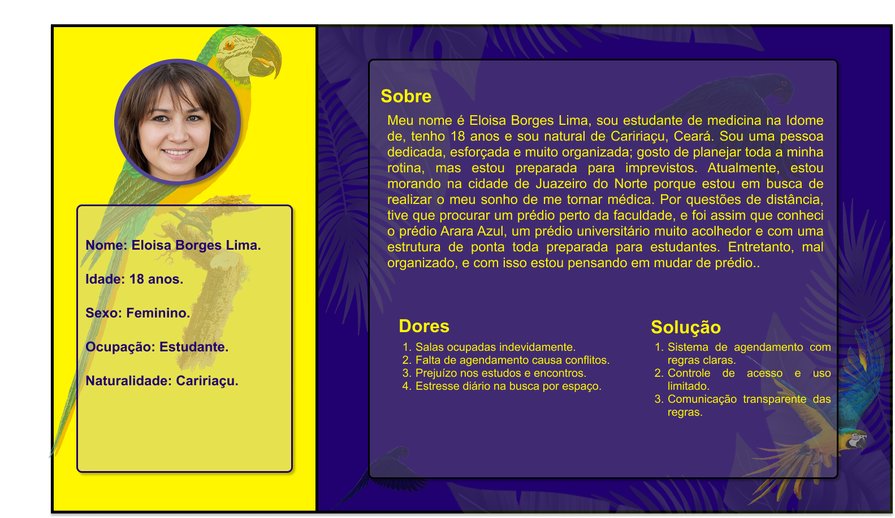
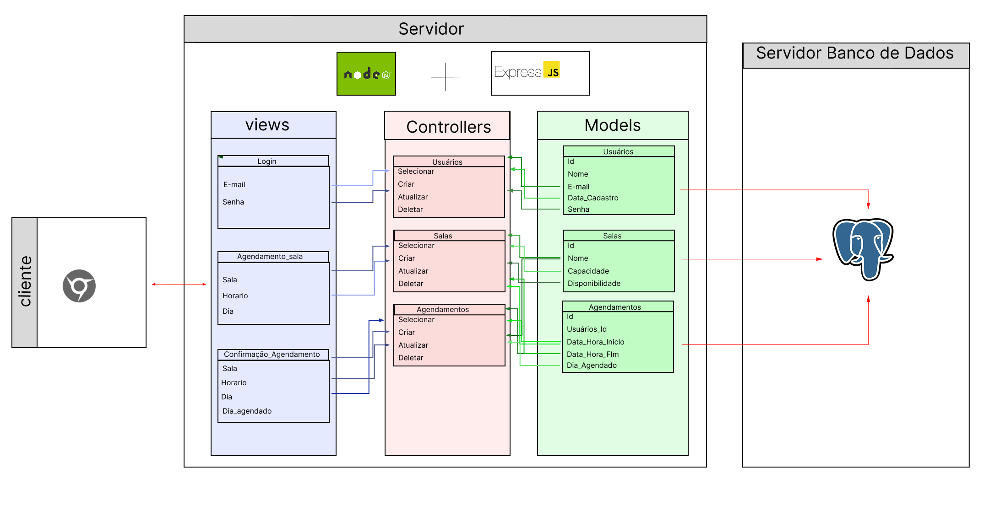
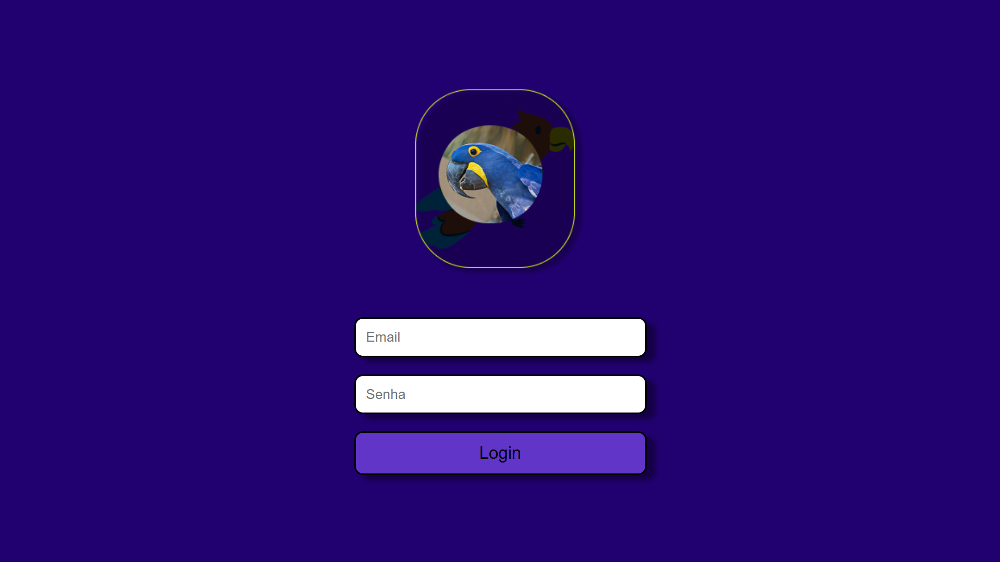
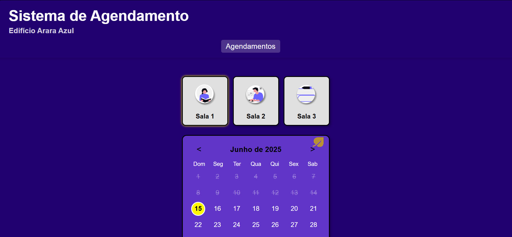
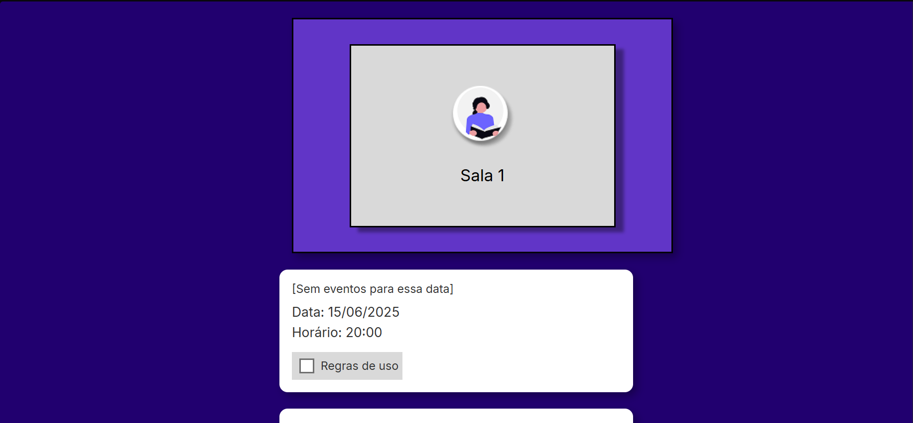

# Web Application Document - Projeto Individual - Módulo 2 - Inteli

**_Os trechos em itálico servem apenas como guia para o preenchimento da seção. Por esse motivo, não devem fazer parte da documentação final._**

## Sistema online para reservar salas de estudo no Edifício Arara Azul.

#### Francisco de Araujo Ferreira Filho

## Sumário

1. [Introdução](#c1)  
2. [Visão Geral da Aplicação Web](#c2)  
3. [Projeto Técnico da Aplicação Web](#c3)  
4. [Desenvolvimento da Aplicação Web](#c4)  
5. [Referências](#c5)  

 

## 1. Introdução 

Em um prédio estudantil chamado "Arara Azul", há diversas salinhas de estudo que são disponibilizadas para os moradores. Entretanto, devido à desorganização do prédio e à falta de regras claras, há diversos conflitos entre as pessoas, como moradores que deixam suas coisas nas salinhas e não voltam, além de pessoas que passam muito tempo sem deixar outras usarem. Com isso, o prédio Arara Azul decidiu entrar em contato com Francisco, aluno do Inteli, para que ele conseguisse resolver aquele problema. Assim, Francisco observou a necessidade de criar uma plataforma com um sistema de agendamento para as salas de estudo, com horários bem definidos, certas limitações de agendamento sucessivos e com as regras do espaço para que todos os moradores conseguissem usar sem nenhum conflito .

---

## 2. Visão Geral da Aplicação Web

### 2.1. Personas 
Personas são arquétipos de usuários, criados para personificar os diferentes perfis que farão uso do produto. Elas desempenham um papel crucial ao nos permitir compreender profundamente as demandas dos usuários e, consequentemente, moldar a solução para melhor atender ao público-alvo. Com base nessa premissa, abaixo será mostrada a persona de uma estudante de medicina moradora do prédio. (Na imagem são mostradas as características da persona. Consulte a documentação para mais detalhes.)

  Persona Eloisa Borges Lima 
  

### **Necessidades**
Eloísa necessita da capacidade de planejar e reservar com antecedência um espaço de estudo nas salinhas do prédio "Arara Azul" de forma previsível, eliminando a incerteza e a pressa diária. É fundamental para ela assegurar que, ao chegar à sala de estudo agendada, o espaço estará disponível, organizado e propício para suas atividades acadêmicas, seja para estudo individual ou em grupo. Dessa forma, ela poderá otimizar seu tempo pós-faculdade, focando nos estudos sem o estresse de procurar por uma sala livre.

### **Dores**
Ao chegar da faculdade, geralmente por volta das 16h, Eloísa frequentemente se depara com a indisponibilidade e o uso inadequado das salinhas de estudo. A ausência de um sistema de agendamento claro resulta em situações caóticas: moradores ocupam as salas por períodos excessivos, por vezes desde o meio-dia, impedindo o rodízio. Além disso, sem uma gestão adequada, esses espaços são desvirtuados do seu propósito, utilizados para lazer como jogos eletrônicos, o que prejudica o ambiente acadêmico. Há também a frustração com a "ocupação fantasma", onde as salinhas estão cheias de pertences como mochilas e cadernos, mas sem pessoas presentes, resultando em espaços bloqueados e inutilizados. Consequentemente, a falta de um mecanismo de reserva eficaz impede Eloísa de encontrar um espaço adequado e com privacidade para realizar seus estudos e de se encontrar com suas amigas para sessões de estudo em grupo ou para tirar dúvidas, afetando diretamente suas notas. A necessidade constante de "correr" para tentar pegar uma sala e a frustração de não encontrar ambientes disponíveis devido à ausência de organização prévia geram um impacto negativo em seu bem-estar e na sua satisfação com o prédio Arara Azul.

### **Solução Proposta**
Com a implementação do sistema de agendamento das salinhas de estudo, proposta por Francisco, os alunos terão acesso a esses espaços de forma organizada e com regras claras.

- **Acesso Controlado por Agendamento:** Garante que apenas usuários com agendamento possam utilizar as salas, eliminando a ocupação indevida.

- **Bloqueio de Agendamentos Sucessivos:** Implementa limites para o tempo de uso contínuo, promovendo o rodízio e a justiça na utilização do espaço.

- **Comunicação de Regras:** A plataforma poderá exibir as regras de uso das salas, incentivando um ambiente mais respeitoso e produtivo para todos.

### 2.2. User Stories 

**US01-** Como moradora, eu quero poder ver eventos que irão interditar as salinhas de estudo, para que eu consiga organizar minha rotina de estudos sem imprevistos.

**US02-** Como moradora, eu quero que a plataforma indique boas práticas de cuidado com a sala agendada, para que não prejudique a experiência do próximo usuário e mantenha o ambiente organizado.

**US03-** Como moradora, eu quero poder ver os horários disponíveis das salinhas particulares e agendá-las, para que eu consiga organizar e garantir meu espaço de estudo.

## Método INVEST
O Método INVEST é utilizado para analisar a qualidade de uma User Story com critérios de avaliação para garantir que as histórias estejam bem escritas e eficazes para o planejamento e desenvolvimento. Cada letra do acrônimo representa uma característica importante que uma boa User Story deve ter:

- ***I - Independent (Independente):***
A User Story US03 por si só possui uma história independente. Com ela, temos a informação de que o morador busca visualizar e agendar horários de salinhas de estudo para organizar seu aprendizado. Embora existam dependências da infraestrutura básica (como o sistema de login ou a existência das salas), a funcionalidade de visualizar e agendar é independente de outras funcionalidades maiores, como o cancelamento de agendamento, por exemplo.

- ***N - Negotiable (Negociável):***
A história US03 é negociável, porque, embora defina a capacidade de visualizar horários e realizar o agendamento, ela não especifica o método exato de agendamento (ex: calendário interativo vs. lista), a interface ou as regras detalhadas de bloqueio (ex: "agendamentos sucessivos"). Isso permite que a equipe de desenvolvimento debata e defina a melhor abordagem durante o planejamento.

- **V - Valuable (Valiosa):**
A User Story US03 é extremamente valiosa, pois representa o passo mais importante para a conclusão e resolução direta das dores da persona Eloísa (e de outros moradores). A capacidade de ver a disponibilidade e reservar uma sala garante que os usuários consigam planejar e ter um espaço garantido para estudar, resolvendo o problema central de desorganização e impactando positivamente a qualidade de vida no prédio.

- **E - Estimable (Estimável):**
Com as informações da história e o contexto do problema, a User Story US03 é altamente estimável. A equipe de desenvolvimento deverá analisar os requisitos de interface (front-end), a interação com o backend (API de agendamento) e o banco de dados para definir a abordagem técnica e estimar o esforço necessário para sua implementação.

- **S - Small (Pequena):**
A User Story US03 representa a funcionalidade específica de visualizar os horários disponíveis e realizar o agendamento de salinhas particulares. Ela é uma parte importante do sistema completo e, idealmente, é uma tarefa que pode ser desenvolvida e entregue em uma única sprint. No entanto, se a análise detalhada revelar alta complexidade, essa história pode ser desmembrada em histórias menores e mais focadas, como "Visualizar disponibilidade das salas" e "Agendar uma sala em um horário específico", para garantir um trabalho gerenciável e entregas incrementais.

- **T - Testable (Testável):**
A User Story US03 é testável, e seus critérios de aceite podem ser definidos claramente a partir da história e das dores da persona Eloísa. Exemplos de critérios de aceite incluem:
  - O morador deve conseguir visualizar um calendário ou lista com a disponibilidade atual das salinhas.

  - O morador deve conseguir selecionar uma data e hora e efetivar a reserva de uma salinha.

  - O sistema deve impedir agendamentos em horários já ocupados ou que excedam os limites de agendamento.

  - Após o agendamento bem-sucedido, o morador deve receber uma confirmação na plataforma.

---

##  Projeto da Aplicação Web

### 3.1. Modelagem do banco de dados  (Semana 3)

### Modelo lógico do banco de dados

   
  

### Modelo físico do banco de dados

[Clique aqui para acessar o modelo físico do banco de dados](/scripts/init.sql)

### 3.1.1 BD e Models (Semana 5)
[Clique aqui para acessar a explicação dos models no meu sistema](detalhamento_models.md)

### 3.2. Arquitetura (Semana 5)
O esquema de arquitetura MVC (Model-View-Controller) é uma representação visual que ilustra como os diferentes módulos de um software se organizam e interagem, seguindo o padrão MVC. Esse diagrama ajuda a visualizar elementos da aplicação, como as tabelas do banco de dados, seus campos, as operações básicas de dados (Criar, Ler, Atualizar e Excluir), as telas do sistema, as tecnologias empregadas e os caminhos de acesso definidos.

   
  

### **•View (Visão)**
Esta primeira área do diagrama representa a Visão, que é a parte da aplicação que o usuário realmente vê e com a qual interage. Ela é responsável por apresentar as informações ao usuário e por capturar suas ações, enviando-as para o Controller. Nesse sentido, nela está contido todas as tela
s da aplicação web que nesse caso são a tela de login, agendamento e a de confirmação de agendamento. Sendo assim, cada requisição está representada em sua respectiva tela, indicando o que acontecerá nela e qual será o fluxo.

- **Login:** a tela de login tem dois atributos principais, o email e a senha. Quando o usuário colocar o email e a senha, a requisição é mandada para o controller, que por lar ele pede para o model conferir no banco de dados se aquele email e senha existe, ou então cria um email e senha.

- **Agendamentos:** a tela de agendamento tem três atributos principais para a seleção: a Sala, o Horário e o Dia. Quando o usuário seleciona esses dados, a requisição é enviada para o Controller de Agendamentos. Este, por sua vez, solicita ao Model de Agendamentos que verifique a disponibilidade da sala, horário e dia no banco de dados. A resposta dessa verificação é então retornada para a View, preparando-se para a etapa de confirmação.

- **Confirmação_Agendamento:** a tela de confirmação de agendamento exibe os detalhes do agendamento previamente selecionado (Sala, Horário, Dia) e adiciona o atributo Dia_agendado (que indica quando a confirmação está sendo feita). É nessa tela que o usuário finaliza o agendamento. Ao confirmar, uma nova requisição é enviada ao Controller de Agendamentos, que então instrui o Model a registrar efetivamente o agendamento no banco de dados. Após a conclusão bem-sucedida dessa operação, o Controller envia uma resposta para a View, indicando que o agendamento foi concluído.

#### **•Controller (Controlador)**
A área central simboliza o Controlador, que atua como um elo entre a Visão e o Modelo. Sua função é receber as interações da interface, aplicar a lógica de negócios necessária e encaminhá-las ao Modelo. Ele também coordena o retorno das informações processadas de volta para a Visão. Nessa pespectiva, ela representa as tebales que estão no módel e as operações possíveis de serem realizadas.

**Usuários (Controller):** O Controller de Usuários é responsável por gerenciar as operações relacionadas aos dados dos usuários. Ele recebe requisições da View (como a tela de Login) para:

- Selecionar: Verificar a existência de um usuário e suas credenciais no Model de Usuários (comunicando-se com a tabela de Usuários no banco de dados).
- Criar: Inserir um novo registro de usuário no Model de Usuários (adicionar um novo usuário ao banco).
- Atualizar: Modificar informações de um usuário existente no Model de Usuários.
- Deletar: Remover um registro de usuário do Model de Usuários. Ele coordena com o Model de Usuários para realizar essas operações e envia as respostas apropriadas de volta para a View.

**Salas (Controller):** O Controller de Salas é encarregado das operações de gerenciamento das salas. Ele recebe requisições para:

- Selecionar: Consultar informações sobre as salas disponíveis no Model de Salas (como nome, capacidade e disponibilidade).
- Criar: Adicionar novos registros de salas no Model de Salas.
 -Atualizar: Modificar os detalhes de salas existentes no Model de Salas.
- Deletar: Remover registros de salas do Model de Salas. Este Controller interage diretamente com o Model de Salas para obter ou modificar os dados e retorna os resultados para as Views que precisam dessas informações.

**Agendamentos (Controller):** O Controller de Agendamentos é crucial para orquestrar o processo de agendamento de salas. Ele recebe requisições das Views de Agendamento e Confirmação_Agendamento para:

- Selecionar: Verificar a disponibilidade de salas para datas e horários específicos no Model de Agendamentos.
- Criar: Registrar um novo agendamento no Model de Agendamentos, uma vez que a disponibilidade tenha sido confirmada e o usuário tenha finalizado a operação.
- Atualizar: Modificar os detalhes de agendamentos existentes no Model de Agendamentos.
- Deletar: Cancelar ou remover agendamentos no Model de Agendamentos. Ele atua como o intermediário principal para todas as ações relacionadas a agendamentos, garantindo que a lógica de negócios seja aplicada antes de interagir com o Model de Agendamentos para persistir ou recuperar os dados.

 #### **•Model (Modelo)**
A terceira área corresponde ao Modelo, que representa a camada de dados da aplicação. O Modelo se comunica diretamente com o banco de dados, sendo capaz de acessar, modificar ou recuperar informações das tabelas. Quando uma solicitação chega a ele através do Controlador, o Modelo executa a operação de dados requerida e envia os resultados de volta ao Controlador.

**Usuários (Model):** O Model de Usuários corresponde à tabela de Usuários no banco de dados. Ele é responsável por gerenciar os dados dos usuários e suas credenciais. Seus principais atributos são:

- Id: Um identificador único para cada usuário.
- Nome: O nome completo do usuário.
- E-mail: O endereço de e-mail do usuário, frequentemente usado como identificador de login.
- Data_Cadastro: A data em que o usuário foi registrado no sistema.
- Senha: A senha do usuário, armazenada de forma segura. Este Model é acessado pelo Controller de Usuários para realizar operações como verificar credenciais, criar novos usuários, atualizar informações ou deletar registros.

**Salas (Model):** O Model de Salas representa a tabela de Salas no banco de dados. Ele armazena as informações detalhadas sobre cada sala disponível para agendamento. Seus principais atributos são:

- Id: Um identificador único para cada sala.
- Nome: O nome ou identificação da sala.
- Capacidade: O número máximo de pessoas que a sala pode acomodar.
- Disponibilidade: Um indicador que mostra se a sala está livre ou ocupada em determinados períodos. Este Model é consultado pelo Controller de Salas (e indiretamente pelo Controller de Agendamentos) para obter informações sobre as salas, verificar sua capacidade e disponibilidade antes de um agendamento.

**Agendamentos (Model):** O Model de Agendamentos corresponde à tabela de Agendamentos no banco de dados. Ele é fundamental para registrar e gerenciar todos os agendamentos de salas. Seus principais atributos são:

- Id: Um identificador único para cada agendamento.
- Usuarios_Id: Uma chave estrangeira que vincula o agendamento a um usuário específico (da tabela de Usuários), indicando quem fez o agendamento.
- Data_Hora_Inicio: A data e hora exatas de início do agendamento.
- Data_Hora_Fim: A data e hora exatas de término do agendamento.
- Dia_Agendado: A data em que o agendamento foi efetivamente registrado no sistema. Este Model é acessado pelo Controller de Agendamentos para criar novos agendamentos, consultar agendamentos existentes (para verificar disponibilidade ou listar agendamentos de um usuário), atualizar horários ou cancelar agendamentos. Ele desempenha um papel crucial na lógica de verificação de conflitos de horário.
  

### 3.3. Wireframes 

### **Tela de login**
**User Storie:** Não está associada a nenhuma US.

  Wireframe tela 1 
  

A tela de login é essencial para o acesso dos moradores à plataforma de agendamento das salas de estudo do prédio. O e-mail cadastrado no sistema do edifício deve ser utilizado para entrar.
 

### **Tela de agendamento**
**User Storie:** 
- "Como uma estudante de medicina e moradora do prédio, quero poder ver os horários disponível de agendamento das salinhas particulares para que eu consiga organizar meus estudos."

  Wireframe tela 2 
  

A tela de agendamento é fundamental para otimizar a experiência dos estudantes nos espaços de estudo, pois permite visualizar os dias com os horários disponíveis, selecionar a sala desejada e agendar horários com bastante antecedência. Observa-se que os horários são marcados de 4 em 4 horas, um tempo perfeito para estudar todo o conteúdo com amigos ou individualmente. Dessa forma, soluciona completamente a questão levantada, pois resolve com eficiência a demanda da Eloisa de ver os dias e horários livres das salinhas de estudo, que ficam visíveis na parte inferior do wireframe (horários sem marcação).

### **Tela de confirmação de reserva**
**User Storie:** 
- "Como moradora, eu quero que na plataforma indique boas práticas de cuidado com a sala agendada para que não prejudique a experiência do próximo."
- "Como moradora, eu quero poder ver eventos que irão interditar as salas para que eu consiga organizar minha rotina".

  Wireframe tela 3 
  

A tela de confirmação é um passo importante para nossa plataforma. Nela, é possível visualizar a data, o horário, as regras de uso e os eventos que poderiam interditar a sala de estudo. Desse modo, soluciona com clareza as dúvidas da Eloisa sobre possíveis interdições das salinhas, como uma detetização, e as normas de convivência do local.

#### **link do figma:** https://www.figma.com/design/6vGv5QEdLNycb3QFHrQ7h8/Untitled?node-id=0-1&t=BKp1rVrURdjMeIUL-1

### 3.4. Guia de estilos 

## Guia de Estilo – Arara Azul (Mobile)

## Contexto
Aplicativo mobile para reserva de salas de estudo do prédio **Arara Azul**, exclusivo para estudantes.

---

## Paleta de Cores

| Função | Descrição | HEX | Representação |
|---|---|---|---|
| Primária | Azul Escuro | `#21006F` |  |
| Primária | Azul Secundário | `#6135C7` |  |
| Secundária | Branco | `#FFFAFA` |  |
| Secundária | Preto | `#000000` |  |
| Terciária | Cinza Claro | `#D9D9D9` |  |
| Terciária | Cinza Médio | `#817E7E` |  |
| Destaque | Amarelo (Seleção) | `#FFF600` |  |

---

## Tipografia

- **Fonte:** Inter
- **Estilo:** Regular
- **Capitalização:** Primeira letra em maiúsculo nas frases.

### Tamanhos

| Aplicação | Tamanho | Representação |
|---|---|---|
| Títulos | 20 | Exemplo |
| Botões e Informações | 16 | Exemplo |
| Avisos e Observações | 12 | Exemplo |

---

## Componentes e Elementos Visuais

### Botões
- Fundo: `#21006F`, `#6135C7` ou `#000000` (para botões de ação como "Reservar", "Continuar")
- Texto: `#FFFAFA` (branco) ou `#000000` (preto)
- Raio (arredondamento): 10px
- Stroke (borda): Preto (`#000000`), 2px de espessura
- Sombra:
    - Offset X: 6
    - Offset Y: 4
    - Blur: 4
    - Spread: 2

**Representação:**
<button style="background-color: #21006F; color: #FFFAFA; border: 2px solid #000000; border-radius: 10px; padding: 8px 16px; font-family: 'Inter', sans-serif; font-size: 16px; box-shadow: 6px 4px 4px 2px rgba(0,0,0,0.4);">Botão Exemplo</button> 
<button style="background-color: #6135C7; color: #FFFAFA; border: 2px solid #000000; border-radius: 10px; padding: 8px 16px; font-family: 'Inter', sans-serif; font-size: 16px; box-shadow: 6px 4px 4px 2px rgba(0,0,0,0.4);">Botão Exemplo</button> 
<button style="background-color: #000000; color: #FFFAFA; border: 2px solid #000000; border-radius: 10px; padding: 8px 16px; font-family: 'Inter', sans-serif; font-size: 16px; box-shadow: 6px 4px 4px 2px rgba(0,0,0,0.4);">Botão Exemplo</button>

### Caixas (Inputs, Avisos, Informações)
- Fundo: Branco (`#FFFAFA`) ou Cinza (`#D9D9D9`)
- Borda: Stroke Preto (`#000000`), 2px
- Raio: 10px
- Sombra padrão (X:6, Y:4, Blur:4, Spread:2)

**Representação:**

    
Exemplo de Caixa Branca

 

    
Exemplo de Caixa Cinza

### Calendário
- Fundo: Azul Escuro (`#21006F`) ou Azul Secundário (`#6135C7`)
- Dia Selecionado: Fundo Amarelo (`#FFF600`)
- Texto: Preto (`#000000`) ou Branco (`#FFFAFA`)

**Representação:**

    
Maio 2025

    

        DSTQQSS
    

    

        1234
        567891011
        12131415161718
        19202122232425
        262728293031
    

### Cartões de Sala
- Fundo: Cinza Claro (`#D9D9D9`)
- Ícones relacionados a estudo
- Texto centralizado: "Sala 1", "Sala 2", etc.

**Representação:**

    📚
    
Sala 1

---

## Ícones e Ilustrações
- Estilo: Flat design (não realista)
- Temática: Estudos e Arara Azul
- Paleta de cores seguindo o padrão do app
- Bordas suaves e harmônicas

**Representação:**

    📘🐦

---

## Layout e Grid

- **Tamanho do Frame:** 402x935 px (Mobile)
- **Grid:**
    - 6 colunas
    - Cor do grid: Vermelha
- **Espaçamento:**
    - Segue múltiplos de 8px (recomendado)

**Representação (simplificada do conceito de grid):**

    

    

    

    

    

    

---

## Efeitos (Sombra padrão)

- Offset X: 6
- Offset Y: 4
- Blur: 4
- Spread: 2

**Representação:**

---

## Observações Gerais

- Todos os elementos possuem raio de 10px e borda preta de 2px.
- Consistência nas sombras e bordas para garantir unidade visual.
- A estética reflete a identidade do prédio Arara Azul e o foco em ambiente acadêmico.

---

### 3.5. Protótipo de Alta Fidelidade 

| Tela de Login | Tela de Agendamento | Tela de Confirmação |
| :------------: | :------------------: | :-----------------: |
|  |  |  |

🔗 **Link do Figma:** [Acessar protótipo](https://www.figma.com/design/6vGv5QEdLNycb3QFHrQ7h8/Untitled?node-id=0-1&t=BKp1rVrURdjMeIUL-1)

### 3.6. WebAPI e endpoints 

[Clique aqui para acessar o detalhamento de cada endopoint aplicada para o funcionamento do projeto](detalhamento_endpoints.md)

### 3.7 Interface e Navegação 

-------------------------
Nesta etapa do projeto, o frontend do sistema web foi desenvolvido, focando nas telas de login, agendamento e confirmação. Utilizamos EJS, CSS e JavaScript para criar uma interface funcional, bonita e interativa, que materializa a idealização dos protótipos de alta fidelidade, conectando o usuário à complexa arquitetura de backend.

## Pagina de login

  Tela de login do sistema web 
  

A tela de login é a entrada principal da plataforma Arara Azul, com design limpo e seguro. Apresenta campos para "E-mail" e "Senha", e um botão "Login" proeminente. Priorizando a simplicidade e eficiência, ela se integra ao loginController para processar credenciais, fornecendo feedback visual rápido e garantindo responsividade em diversos dispositivos via CSS e JavaScript.

## Agendamentos

  Tela de agendamentos do sistema web 
  

Esta tela central permite ao morador selecionar a data e o horário desejado para as salinhas de estudo. Exibe um calendário interativo para a escolha da data e, abaixo, os horários disponíveis para seleção. A página também apresenta uma área de "Avisos" com as regras do prédio. O botão "Continuar" serve para prosseguir com a seleção para uma confirmação posterior, não efetivando a reserva diretamente nesta etapa. O design visa clareza e facilidade na escolha do período de uso.

## Página de Confirmação de Agendamento

  Tela de confirmação de agendamento do sistema web 
  

A tela de confirmação exibe os detalhes da reserva (Sala, Data, Horário) para revisão final. Inclui um checkbox e aviso sobre as "Regras de uso", exigindo que o morador as aceite. O botão "Reservar" finaliza o agendamento, tornando-o oficial. O design visa clareza e consentimento do usuário.

 
---

## 4. Desenvolvimento da Aplicação Web 

### 4.1 Demonstração do Sistema Web 

[Drive com o video de demonstração](https://drive.google.com/drive/folders/1i_LVkiM6RI0ENe0U67Tj0qfsPPWQJM3Z?hl=pt-br )

### Desenvolvimento do Sistema Web Completo - Edifício Arara Azul

Este seção tem como objetivo descrever e ilustrar o desenvolvimento do sistema web de agendamento de salas de estudo para o Edifício Arara Azul, detalhando as entregas em termos de código e funcionalidades, as tecnologias empregadas e os principais desafios superados.

### 4.1.1 Visão Geral do Sistema
O sistema de agendamento de salas de estudo do Edifício Arara Azul foi concebido para resolver a desorganização e os conflitos no uso desses espaços pelos moradores. Ao proporcionar uma plataforma online para visualização, agendamento e gerenciamento das salinhas, o projeto visa otimizar o tempo dos estudantes, garantir o acesso justo aos recursos e promover um ambiente de estudo mais harmonioso e produtivo.

### 4.1.2 Desenvolvimento do Frontend: Interface e Navegação

Nesta etapa crucial do projeto, concentramos nossos esforços no desenvolvimento das interfaces que os moradores do prédio irão interagir. O foco principal foi a construção das telas de **login**, **agendamento de salinhas** e **confirmação de agendamento**, que são a espinha dorsal da experiência do usuário na plataforma.

Utilizamos uma combinação robusta de tecnologias: **HTML** para a estruturação das páginas, **CSS** para estilização (garantindo um design atraente e intuitivo), **EJS (Embedded JavaScript)** para a renderização dinâmica no lado do servidor e **JavaScript** para a interatividade no lado do cliente. Esta fase é vital, pois é onde toda a complexidade do backend se materializa em uma experiência funcional e agradável para o usuário, idealizando os protótipos de alta fidelidade criados anteriormente.

### 4.1.2.1 Página de Login

A tela de login é o ponto de entrada principal, projetada para ser intuitiva e segura. Ela apresenta campos claros para "E-mail" e "Senha" e um botão "Login" proeminente. O design visa a simplicidade e eficiência, permitindo que os moradores acessem suas contas rapidamente.

  Tela de login do sistema web 
  

### 4.1.2.2 Página de Agendamento

Esta tela representa o coração do sistema, permitindo que os moradores visualizem a disponibilidade e selecionem horários para as salinhas de estudo. A interface é dominada por um **calendário interativo** que, ao carregar, **automaticamente seleciona o dia atual** e exibe os horários disponíveis. Ao selecionar uma sala e uma data, o sistema se comunica em tempo real com o backend para **verificar a disponibilidade de cada horário**. Horários já reservados por outros ou que já passaram ficam **visualmente indisponíveis e não podem ser selecionados**, evitando que os usuários percam tempo tentando reservar um slot ocupado. A página também incorpora uma área de "Avisos" com as regras do prédio.

  Tela de agendamentos do sistema web 
  

### 4.1.2.3 Página de Confirmação de Agendamento

A tela de confirmação é a etapa final do processo de agendamento, onde o morador revisa os detalhes de sua reserva antes de finalizar. Ela exibe claramente a **Sala**, **Data** e **Horário** selecionados. Um elemento crucial é a seção "Regras de uso", acompanhada de um checkbox, que reforça a responsabilidade do usuário ao reservar o espaço, garantindo que o usuário esteja ciente e concorde com as condições de uso antes de finalizar a reserva.

  Tela de confirmação de agendamento do sistema web 
  

### 4.1.3 Desenvolvimento do Backend: Estrutura Técnica

Por trás da interface amigável, o sistema conta com uma arquitetura bem definida e robusta, baseada no padrão MVC (Model-View-Controller).

* **Node.js e Express.js:** O backend é construído com Node.js e o framework Express.js. Essa combinação permite um desenvolvimento ágil e escalável, com Express.js gerenciando as rotas, requisições HTTP e respostas do servidor.

* **PostgreSQL:** Como banco de dados relacional, escolhemos o PostgreSQL, conhecido por sua confiabilidade e poder. A biblioteca `pg` é utilizada para a comunicação eficiente entre o Node.js e o banco de dados.

* **Padrão MVC:** O projeto segue rigorosamente o padrão MVC:

  * **Models:** Responsáveis pela lógica de negócio e interação direta com o banco de dados (ex: `usuarioModel.js` e a lógica de agendamento).

  * **Views:** São os arquivos EJS, responsáveis pela apresentação dos dados ao usuário.

  * **Controllers:** Gerenciam a lógica de requisições, processam dados, interagem com os Models e preparam os dados para as Views (ex: `AgendamentoController.js`, `LoginController.js`).

* **Comunicação Frontend-Backend (Fetch API):** A integração entre o frontend e o backend é realizada através da `Fetch API` do JavaScript, permitindo a comunicação assíncrona. Isso é fundamental para funcionalidades como a verificação em tempo real da disponibilidade dos horários, onde o frontend envia requisições para o backend e atualiza a interface com base nas respostas do banco de dados.

### 4.1.4 Principais Desafios Enfrentados e Soluções

O desenvolvimento do projeto apresentou alguns desafios importantes, que foram superados com abordagens focadas e eficientes:

* **Garantia da Disponibilidade em Tempo Real:**

  * **Desafio:** O principal desafio foi assegurar que o sistema exibisse a disponibilidade das salas de forma precisa e em tempo real, evitando agendamentos duplos e fornecendo feedback visual imediato ao usuário.

  * **Solução:** Implementamos uma lógica robusta no `AgendamentoController` do backend que verifica sobreposição de horários no banco de dados. No frontend, a função `verificarHorarioDisponivel` faz uma chamada `fetch` assíncrona a essa API, desabilitando automaticamente os botões de horários ocupados na interface.

* **Erro de Coluna no Banco de Dados:**

  * **Desafio:** Enfrentamos um erro persistente de "column 'titulo' does not exist" durante a criação de agendamentos.

  * **Solução:** A investigação revelou um desalinhamento no número de placeholders (`$X`) na query SQL de inserção no `AgendamentoController.js`. A correção da query, ajustando o número de parâmetros, resolveu o problema e permitiu a inserção correta dos agendamentos.

* **Melhoria da Experiência do Usuário (UI/UX):**

  * **Desafio:** A interação inicial do usuário não era tão fluida, com o uso de `alert()`s bloqueantes e a falta de uma seleção inicial no calendário.

  * **Solução:** Substituímos os `alert()`s por mensagens de feedback flutuantes e não-intrusivas. Além disso, implementamos a seleção automática do dia atual no calendário e o carregamento imediato dos horários para esse dia, tornando a navegação mais intuitiva e ágil desde o primeiro acesso.

### 4.1.5. Conclusão

O sistema de agendamento do Edifício Arara Azul representa um avanço significativo na gestão dos espaços de estudo. Através de um desenvolvimento que prioriza a usabilidade e a integração robusta entre frontend e backend, a plataforma entrega valor real aos moradores, promovendo organização, justiça e uma experiência otimizada para suas necessidades acadêmicas.

### 4.2 Conclusões e Trabalhos Futuros 

### pontos fortes da minha aplicação web
- **1. Adesão ao Problema Central:** A plataforma foi diretamente desenvolvida para solucionar a dor primordial dos moradores, exemplificada pela persona Eloísa: a dificuldade em encontrar e garantir um espaço de estudo. O sistema de agendamento aborda essa necessidade de previsibilidade e acesso justo.

- **2. Design Centrado no Usuário:** A criação da persona e a aplicação das Heurísticas de Nielsen demonstraram um compromisso com a experiência do usuário. As telas de login, agendamento e confirmação foram projetadas para serem intuitivas e claras, facilitando a interação dos moradores com o sistema.

- **3. Estrutura de Código Modular:** A organização em controladores e rotas, juntamente com o uso de EJS, CSS e JavaScript, cria uma arquitetura modular e de fácil manutenção, preparando o terreno para futuras expansões.

- **4. Utilização de Metodologia Ágil:** A aplicação do Método INVEST na validação das User Stories reforça uma abordagem de desenvolvimento que prioriza a entrega de valor incremental e a adaptabilidade às necessidades do projeto.

### Planos Futuros
- **1. Implementação de Testes de Integração:** Desenvolver testes que simulem a interação completa do frontend com o backend e o banco de dados, garantindo a integridade das operações de agendamento e a persistência das informações.

- **2. Gerenciamento Completo de Agendamentos:**
  - **Cancelamento e Edição:** Funcionalidade para que os moradores possam cancelar ou modificar seus próprios agendamentos.

  - **Histórico de Reservas:** Uma seção no perfil do morador que exiba todas as suas reservas passadas e futuras.

- **3. Sistema de Notificações:**

  - **Lembretes de Agendamento:** Notificações automáticas (via plataforma ou e-mail/push, se aplicável) para lembrar o usuário de um agendamento próximo.

  - **Alertas de Mudanças:** Notificações sobre interdições inesperadas ou mudanças nas regras das salas.

- **4. Painel Administrativo/Portaria:** Desenvolver uma interface restrita para os administradores do prédio (ex: portaria), permitindo:
  - **Visualizar todos os agendamentos.**
  - **Bloquear salas para manutenção.**
  - **Gerenciar regras de uso e usuários.**
  - **Acessar relatórios de utilização das salinhas.**

- **5. Funcionalidades de Acessibilidade e Responsividade:** Aprimorar a acessibilidade da interface para garantir que a plataforma seja utilizável por todos, independentemente de suas necessidades especiais. Refinar a responsividade para uma experiência impecável em dispositivos móveis e tablets.

- **6. Versão Mobile/Responsividade Aprimorada:** Otimizar a interface para garantir uma experiência de usuário fluida e responsiva em dispositivos móveis (smartphones e tablets), adaptando o layout e os elementos interativos para diferentes tamanhos de tela.

### 4.3 Tecnologias Utilizadas no Projeto
Este projeto de sistema de agendamento de salas foi construído utilizando um conjunto de tecnologias modernas e robustas, organizadas para garantir eficiência, escalabilidade e uma boa experiência de desenvolvimento e uso.

### Linguagem de Programação

* **JavaScript (Node.js):** A principal linguagem de programação utilizada em todo o projeto, tanto no backend quanto no frontend (via JavaScript no navegador). Node.js permite a construção de aplicações full-stack com uma única linguagem.

### Backend

* **Express.js:** Um framework de aplicação web minimalista e flexível para Node.js. Ele é responsável por gerenciar as rotas, requisições HTTP e respostas do servidor, formando a base da arquitetura MVC.
* **Nodemon:** Uma ferramenta de desenvolvimento que monitora alterações nos arquivos do projeto e reinicia automaticamente o servidor Node.js, agilizando o ciclo de desenvolvimento.
* **CORS:** Um pacote Node.js para habilitar o Cross-Origin Resource Sharing (CORS), permitindo que o servidor aceite requisições de diferentes origens (domínios), o que é comum em arquiteturas com frontend e backend separados ou durante o desenvolvimento local.

### Frontend

* **HTML:** A linguagem de marcação padrão para criar a estrutura das páginas web do sistema.
* **CSS:** Utilizado para estilizar as páginas HTML, garantindo um design visualmente atraente e responsivo para o sistema de agendamento.
* **EJS (Embedded JavaScript):** Um motor de templates que permite embutir código JavaScript diretamente no HTML, facilitando a renderização de páginas dinâmicas no lado do servidor.
* **JavaScript (Browser):** Responsável por toda a interatividade no lado do cliente, incluindo a lógica do calendário, seleção de horários, comunicação assíncrona com o backend (via `fetch`) para verificar a disponibilidade de agendamentos e a exibição de mensagens de feedback.

### Banco de Dados

* **PostgreSQL:** Um sistema de gerenciamento de banco de dados relacional objeto-orientado (ORDBMS) robusto, confiável e de código aberto. É utilizado para armazenar todos os dados do sistema, como informações de usuários, salas e agendamentos.
* **`pg`:** O cliente oficial do Node.js para PostgreSQL, utilizado para estabelecer a conexão e executar as operações no banco de dados.

## 5. Referências

Esta seção tem como objetivo apresentar as fontes de informação e as inspirações que guiaram o desenvolvimento do projeto. A pesquisa e a análise de soluções existentes são fundamentais para embasar as decisões de design e funcionalidade, garantindo que o produto final seja eficaz e alinhado às expectativas dos usuários.

### **Aplicativo Apepê** 
A área de agendamento de salas do aplicativo Apepê serviu como uma inspiração fundamental para a concepção da interface e fluxo de agendamento das salinhas de estudo no prédio Arara Azul. Sua abordagem à usabilidade e organização de horários foi um modelo para a funcionalidade central da nossa plataforma.

---
---
