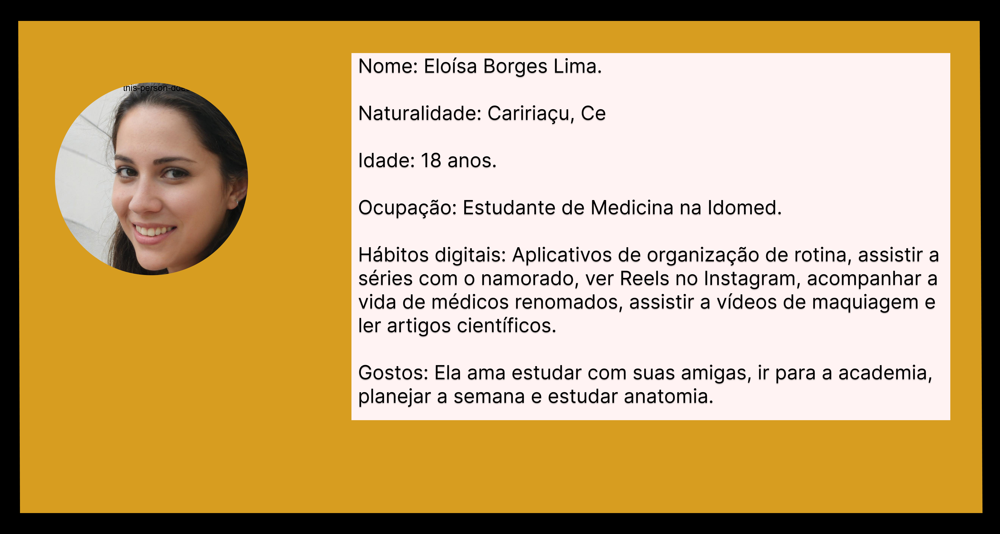
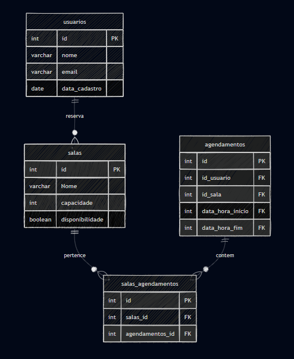
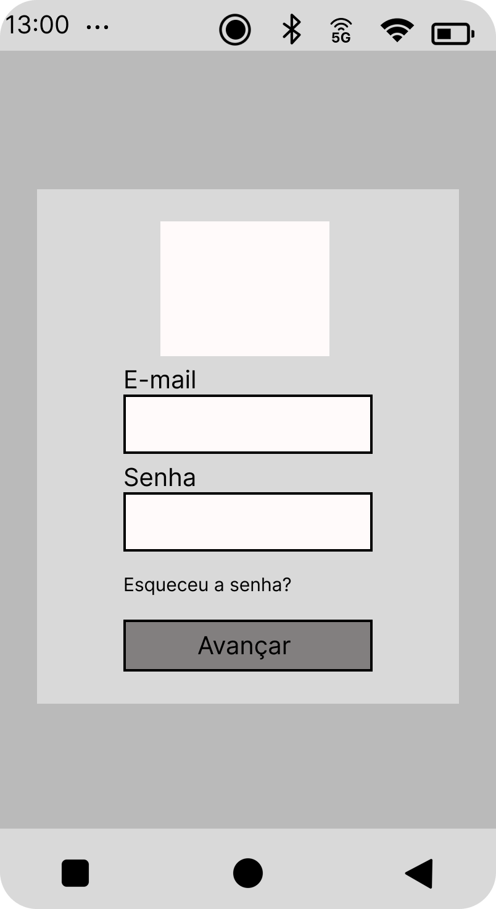
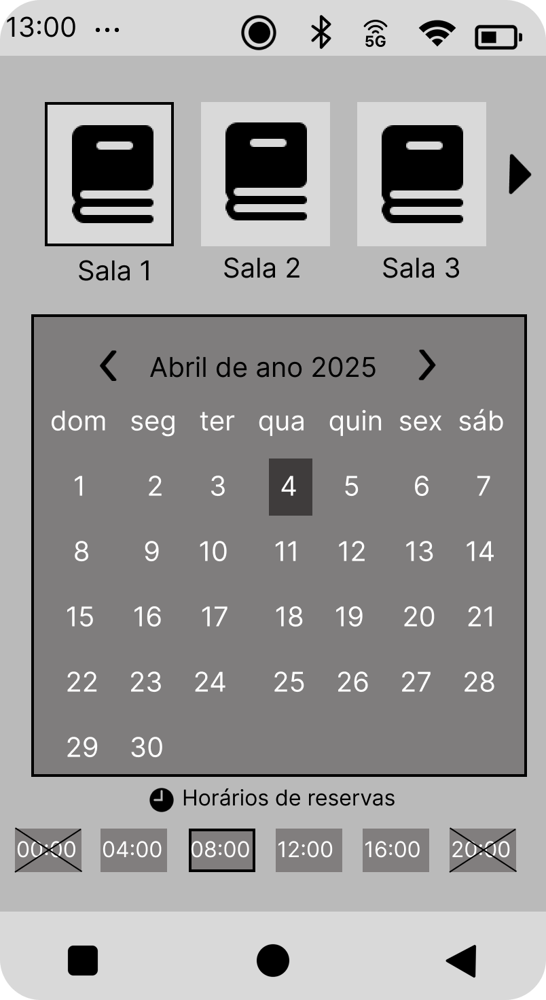
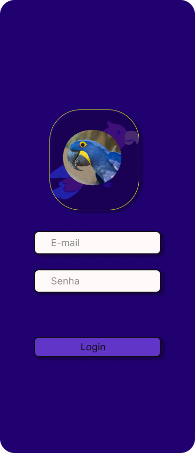
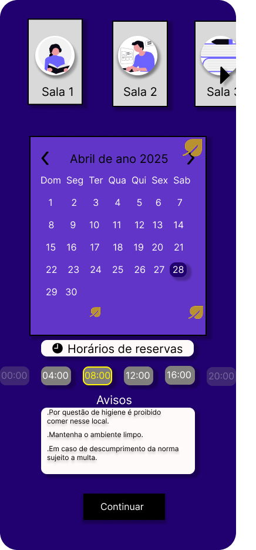
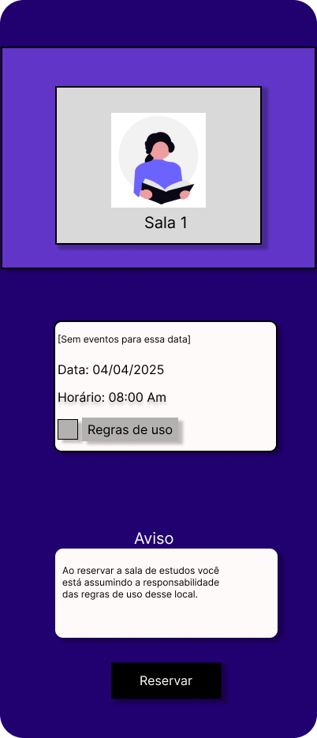

# Web Application Document - Projeto Individual - Módulo 2 - Inteli

**_Os trechos em itálico servem apenas como guia para o preenchimento da seção. Por esse motivo, não devem fazer parte da documentação final._**

## Sistema online para reservar salas de estudo no Edifício Arara Azul.

#### Francisco de Araujo Ferreira Filho

## Sumário

1. [Introdução](#c1)  
2. [Visão Geral da Aplicação Web](#c2)  
3. [Projeto Técnico da Aplicação Web](#c3)  
4. [Desenvolvimento da Aplicação Web](#c4)  
5. [Referências](#c5)  

 

## 1. Introdução (Semana 01)

Em um prédio estudantil chamado "Arara Azul", há diversas salinhas de estudo que são disponibilizadas para os moradores. Entretanto, devido à desorganização do prédio e à falta de regras claras, há diversos conflitos entre as pessoas, como moradores que deixam suas coisas nas salinhas e não voltam, além de pessoas que passam muito tempo sem deixar outras usarem. Com isso, o prédio Arara Azul decidiu entrar em contato com Francisco, aluno do Inteli, para que ele conseguisse resolver aquele problema. Assim, Francisco observou a necessidade de criar uma plataforma com um sistema de agendamento para as salas de estudo, com horários bem definidos, certas limitações de agendamento sucessivos e com as regras do espaço para que todos os moradores conseguissem usar sem nenhum conflito .

---

## 2. Visão Geral da Aplicação Web

### 2.1. Personas (Semana 01)
## Sobre
Meu nome é Eloisa Borges Lima, sou estudante de medicina na Idomede, tenho 18 anos e sou natural de Caririaçu, Ceará. Sou uma pessoa dedicada, esforçada e muito organizada; gosto de planejar toda a minha rotina, mas estou preparada para imprevistos. Atualmente, estou morando na cidade de Juazeiro do Norte porque estou em busca de realizar o meu sonho de me tornar médica. Por questões de distância, tive que procurar um prédio perto da faculdade, e foi assim que conheci o prédio Arara Azul, um prédio universitário muito acolhedor e com uma estrutura de ponta toda preparada para estudantes. Entretanto, mal organizado, e com isso estou pensando em mudar de prédio.

  Persona Eloisa Borges Lima 
  

Necessidades: Eloísa precisa conseguir estudar quando chega da faculdade.

Dores: Ao chegar da faculdade às 16h, ela corre para tentar pegar uma salinha de estudo e, ao chegar lá, encontra o seguinte cenário: algumas pessoas estão na mesma sala desde o meio-dia, outras estão usando o espaço para jogar jogos eletrônicos, e as demais salinhas estão cheias de mochilas e cadernos, mas sem nenhuma pessoa dentro. Nesse cenário, ela não consegue realizar seus estudos, nem individualmente nem em grupo, o que prejudica os encontros marcados com suas amigas e está afetando diretamente suas notas.

Solução: Com a solução e implementação do sistema de agendamento das salinhas de estudo, proposta por Francisco, os alunos só poderão acessar esses espaços mediante agendamento, com bloqueio de agendamentos sucessivos por uma mesma pessoa. Dessa forma, Eloísa conseguirá reservar seu horário na sala de estudos com antecedência. Assim, ela não terá pressa para voltar da faculdade, terá privacidade para estudar, um espaço para estudo coletivo e para tirar dúvidas com as amigas, além de aumentar sua satisfação com o prédio Arara Azul.

### 2.2. User Stories (Semana 01)

US01- Como moradora, eu quero poder ver eventos que irão interditar as salas para que eu consiga organizar minha rotina.

US02- Como moradora, eu quero que na plataforma indique boas práticas de cuidado com a sala agendada para que não prejudique a experiência do próximo.

US03- Como uma estudante de medicina e moradora do prédio, quero poder ver os horários disponível de agendamento das salinhas particulares para que eu consiga organizar meus estudos.

## Método INVEST
Em termos gerais o método INVEST é muito utilizado na metodologia agil para analisar a qualidade de uma user story com critérios de avaliação para garantir que as histórias estejam bem escritas e eficar para o planejamento e desenvolvimento. INVEST(Independent, Negotiable, Valuable, Estimable, Small, Testable).

Ele fornece um conjunto de critérios para garantir que as histórias de usuário sejam bem escritas e eficazes para o planejamento e desenvolvimento. Cada letra do acrônimo representa uma característica importante que uma boa User Story deve ter:

I -  A user story por si só já possui uma história independente, com ela tenho informações que a pessoa é uma estudante e moradora de um prédio e que busca horários de agendamento disponíveis das salas de estudos para melhorar e organizar o seu aprendizado. Pode haver dependências da infraestrutura básica (existência das salas, sistema de login), mas a história em si parece independente dessas camadas subjacentes.

N - A história apresentada é negociável, porque ela é suficientemente genérica, não há nada definido ou fixo, por isso é perfeita para que seja debatida e definida a melhor abordagem pela a equipe de desenvolvimento.

V - A história de usuário criada é extremamente valiosa, porque ela é um passo importante para conclusão e resolução diretamente das dores da personagem, a solução proposta na persona detalha o valor que essa funcionalidade trará.

E - Com as informações da história e o contexto do problema, esse User Story é altamente estimável. A equipe de desenvolvimento deverá analisar, planejar e definir a abordagem que será utilizada para que a estimativa seja feita.

S - Representa a funcionalidade específica de visualizar os horários disponíveis para agendamento das salinhas particulares. Ela representa um parte específica e importante do sistema completo, é um tarefa que pode ser incrementada em uma única sprint.

A implementação dessa funcionalidade pode envolver diversas tarefas complexas. Para garantir que o trabalho seja gerenciável e entregue valor incrementalmente em cada sprint, pode ser necessário dividir essa história em histórias menores e mais focadas, como a capacidade de visualizar a disponibilidade das salas, a ação de agendar um horário específico e a funcionalidade de cancelar um agendamento.

T - Ela é testável, os critérios de aceite podem ser definidos claramente a partir da história e das dores de Eloísa. Por exemplo: A estudante deve conseguir selecionar uma data e hora para agendar uma salinha., Outros moradores devem poder visualizar os horários agendados (dependendo dos requisitos).

---

##  Projeto da Aplicação Web

### 3.1. Modelagem do banco de dados  (Semana 3)

### Modelo lógico do banco de dados

   
  

### Modelo físico do banco de dados

[Clique aqui para acessar o modelo físico do banco de dados](migrations/init.sql)

### 3.1.1 BD e Models (Semana 5)
*Descreva aqui os Models implementados no sistema web*

### 3.2. Arquitetura (Semana 5)

*Posicione aqui o diagrama de arquitetura da sua solução de aplicação web. Atualize sempre que necessário.*

**Instruções para criação do diagrama de arquitetura**  
- **Model**: A camada que lida com a lógica de negócios e interage com o banco de dados.
- **View**: A camada responsável pela interface de usuário.
- **Controller**: A camada que recebe as requisições, processa as ações e atualiza o modelo e a visualização.
  
*Adicione as setas e explicações sobre como os dados fluem entre o Model, Controller e View.*

### 3.3. Wireframes (Semana 03)

### **Tela de login**
**User Storie:** Não está associada a nenhuma US.

  Wireframe tela 1 
  

A tela de login é essencial para o acesso dos moradores à plataforma de agendamento das salas de estudo do prédio. O e-mail cadastrado no sistema do edifício deve ser utilizado para entrar.
 

### **Tela de agendamento**
**User Storie:** 
- "Como uma estudante de medicina e moradora do prédio, quero poder ver os horários disponível de agendamento das salinhas particulares para que eu consiga organizar meus estudos."

  Wireframe tela 2 
  

A tela de agendamento é fundamental para otimizar a experiência dos estudantes nos espaços de estudo, pois permite visualizar os dias com os horários disponíveis, selecionar a sala desejada e agendar horários com bastante antecedência. Observa-se que os horários são marcados de 4 em 4 horas, um tempo perfeito para estudar todo o conteúdo com amigos ou individualmente. Dessa forma, soluciona completamente a questão levantada, pois resolve com eficiência a demanda da Eloisa de ver os dias e horários livres das salinhas de estudo, que ficam visíveis na parte inferior do wireframe (horários sem marcação).

### **Tela de confirmação de reserva**
**User Storie:** 
- "Como moradora, eu quero que na plataforma indique boas práticas de cuidado com a sala agendada para que não prejudique a experiência do próximo."
- "Como moradora, eu quero poder ver eventos que irão interditar as salas para que eu consiga organizar minha rotina".

  Wireframe tela 3 
  

A tela de confirmação é um passo importante para nossa plataforma. Nela, é possível visualizar a data, o horário, as regras de uso e os eventos que poderiam interditar a sala de estudo. Desse modo, soluciona com clareza as dúvidas da Eloisa sobre possíveis interdições das salinhas, como uma detetização, e as normas de convivência do local.

#### **link do figma:** https://www.figma.com/design/6vGv5QEdLNycb3QFHrQ7h8/Untitled?node-id=0-1&t=BKp1rVrURdjMeIUL-1

### 3.4. Guia de estilos (Semana 05)

##  Guia de Estilo –  Arara Azul (Mobile)

##  Contexto
Aplicativo mobile para reserva de salas de estudo do prédio **Arara Azul**, exclusivo para estudantes.

---

##  Paleta de Cores

| Função        | Descrição           | HEX      |
| --------------| -------------------- | -------- |
| Primária      | Azul Escuro          | `#21006F`|
| Primária      | Azul Secundário      | `#6135C7`|
| Secundária    | Branco               | `#FFFAFA`|
| Secundária    | Preto                | `#000000`|
| Terciária     | Cinza Claro          | `#D9D9D9`|
| Terciária     | Cinza Médio          | `#817E7E`|
| Destaque      | Amarelo (Seleção)    | `#FFF600`|

---

##  Tipografia

- **Fonte:** Inter
- **Estilo:** Regular
- **Capitalização:** Primeira letra em maiúsculo nas frases.

###  Tamanhos

| Aplicação               | Tamanho |
| ------------------------| --------|
| Títulos                 | 20      |
| Botões e Informações    | 16      |
| Avisos e Observações    | 12      |

---

##  Componentes e Elementos Visuais

###  Botões
- Fundo: `#21006F`, `#6135C7` ou `#000000` (para botões de ação como "Reservar", "Continuar")
- Texto: `#FFFAFA` (branco) ou `#000000` (preto)
- Raio (arredondamento): 10px
- Stroke (borda): Preto (`#000000`), 2px de espessura
- Sombra:
  - Offset X: 6
  - Offset Y: 4
  - Blur: 4
  - Spread: 2

###  Caixas (Inputs, Avisos, Informações)
- Fundo: Branco (`#FFFAFA`) ou Cinza (`#D9D9D9`)
- Borda: Stroke Preto (`#000000`), 2px
- Raio: 10px
- Sombra padrão (X:6, Y:4, Blur:4, Spread:2)

###  Calendário
- Fundo: Azul Escuro (`#21006F`) ou Azul Secundário (`#6135C7`)
- Dia Selecionado: Fundo Amarelo (`#FFF600`)
- Texto: Preto (`#000000`) ou Branco (`#FFFAFA`)

###  Cartões de Sala
- Fundo: Cinza Claro (`#D9D9D9`)
- Ícones relacionados a estudo
- Texto centralizado: "Sala 1", "Sala 2", etc.

---

##  Ícones e Ilustrações
- Estilo: Flat design (não realista)
- Temática: Estudos e Arara Azul
- Paleta de cores seguindo o padrão do app
- Bordas suaves e harmônicas

---

##  Layout e Grid

- **Tamanho do Frame:** 402x935 px (Mobile)
- **Grid:**
  - 6 colunas
  - Cor do grid: Vermelha
- **Espaçamento:** 
  - Segue múltiplos de 8px (recomendado)

---

##  Efeitos (Sombra padrão)

- Offset X: 6
- Offset Y: 4
- Blur: 4
- Spread: 2

---

##  Observações Gerais

- Todos os elementos possuem raio de 10px e borda preta de 2px.
- Consistência nas sombras e bordas para garantir unidade visual.
- A estética reflete a identidade do prédio Arara Azul e o foco em ambiente acadêmico.

---

### 3.5. Protótipo de Alta Fidelidade (Semana 05)

| Tela de Login | Tela de Agendamento | Tela de Confirmação |
| :------------: | :------------------: | :-----------------: |
|  |  |  |

🔗 **Link do Figma:** [Acessar protótipo](https://www.figma.com/design/6vGv5QEdLNycb3QFHrQ7h8/Untitled?node-id=0-1&t=BKp1rVrURdjMeIUL-1)

### 3.6. WebAPI e endpoints (Semana 05)

*Utilize um link para outra página de documentação contendo a descrição completa de cada endpoint. Ou descreva aqui cada endpoint criado para seu sistema.*  

### 3.7 Interface e Navegação (Semana 07)

*Descreva e ilustre aqui o desenvolvimento do frontend do sistema web, explicando brevemente o que foi entregue em termos de código e sistema. Utilize prints de tela para ilustrar.*

---

## 4. Desenvolvimento da Aplicação Web (Semana 8)

### 4.1 Demonstração do Sistema Web (Semana 8)

*VIDEO: Insira o link do vídeo demonstrativo nesta seção*
*Descreva e ilustre aqui o desenvolvimento do sistema web completo, explicando brevemente o que foi entregue em termos de código e sistema. Utilize prints de tela para ilustrar.*

### 4.2 Conclusões e Trabalhos Futuros (Semana 8)

*Indique pontos fortes e pontos a melhorar de maneira geral.*
*Relacione também quaisquer outras ideias que você tenha para melhorias futuras.*

## 5. Referências

_Incluir as principais referências de seu projeto, para que seu parceiro possa consultar caso ele se interessar em aprofundar. Um exemplo de referência de livro e de site:_ 

---
---
